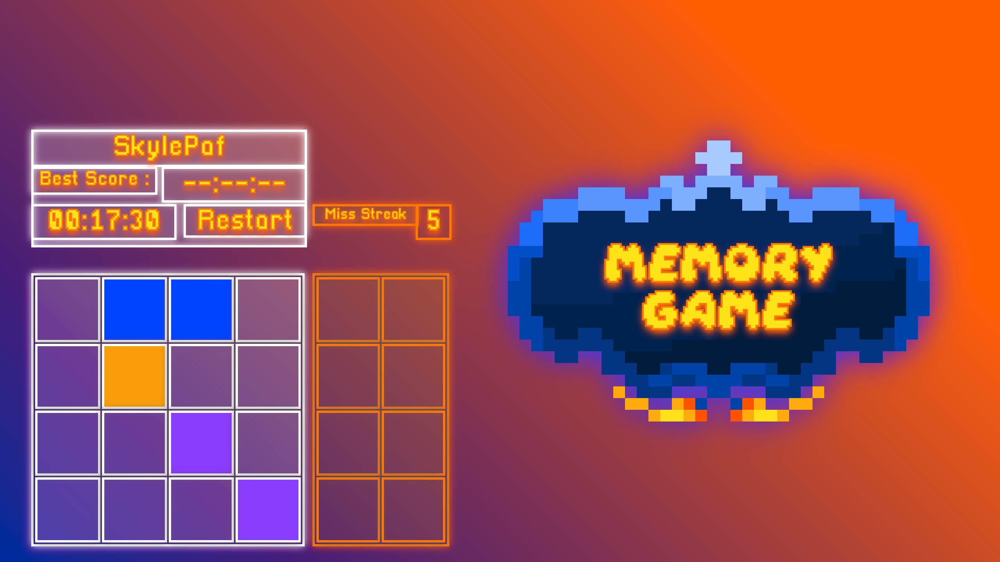
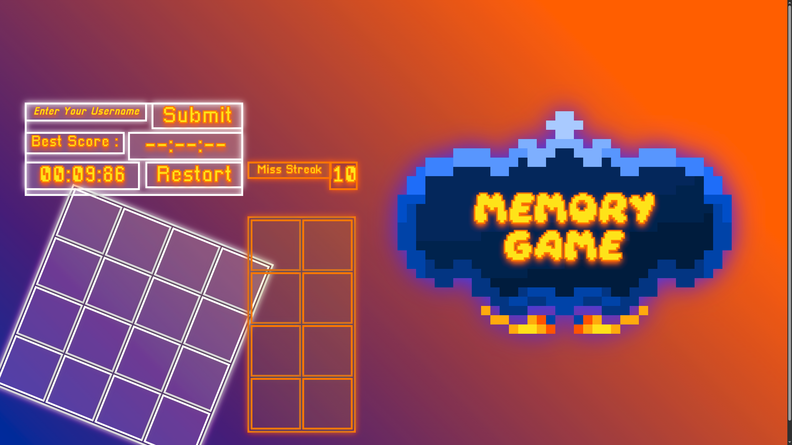
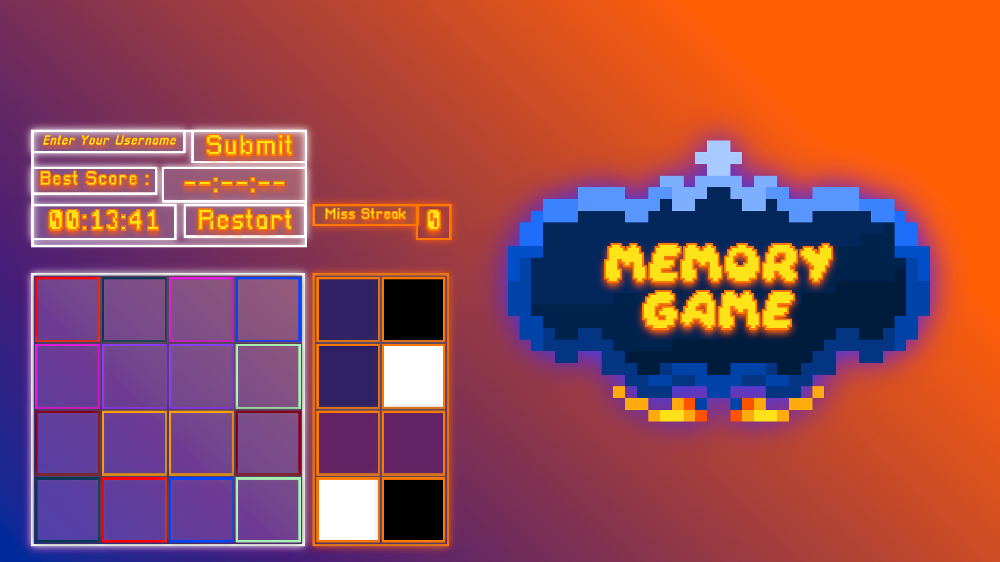
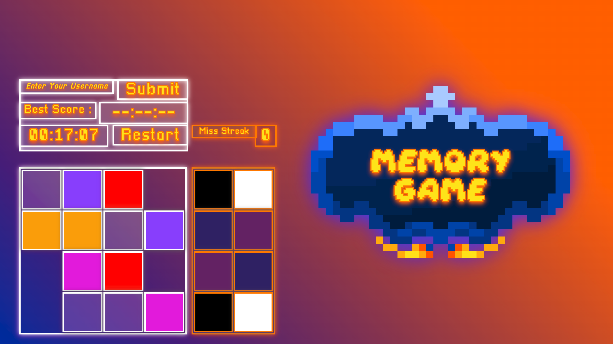

# Memory

> A memory game that fights back.

**Punishment system · Reward system · Expanding grid · Grid rotation · Best score per player**  
Built entirely in vanilla HTML/CSS/JS — no framework, no game engine.

*Built in early 2024.*

[▶ Play Online](https://skylepaf.github.io/The-Memory/web_browser/index.html)

> Browser version: zoom in (Ctrl +) for the best experience.  
> For the best experience, run the Electron version.

---

## Screenshots

| Bad Effect 1 — Extra table | Bad Effect 2 — 180° rotation |
|---|---|
|  |  |

| Reward 1 — Completing extra table | Reward — Minus 4 squares |
|---|---|
|  |  |

---

## How it works

Standard memory on a 4×4 grid — find all 8 color pairs.  
The twist: the game tracks your mistakes and punishes you for them.

### Punishment system

**Bad Effect 1 — 5 miss streak**  
A second 4×2 grid slides in from below. You now have to clear 4 extra pairs on top of the original 16 cells. The miss streak counter appears on screen.

**Bad Effect 2 — 10 total misses**  
The entire game smoothly rotates 180°. You finish upside down.

### Reward system

**Good Effect 1 — Completing the extra grid**  
The game reveals a the game temporarily: every squares have their borders switch to their colors for few seconds.

**Good Effect 2 — 3 findings streak in under 10 tries**  
The main grid will have 2 pairs removed, shrikking the main grid to 6 pairs to find.

---

## Features

- **Expanding grid** — extra table slides in with a smooth `requestAnimationFrame` animation
- **8 sequential right-answer sounds** — each correct pair has its own sound, in order
- **3 OSTs** — randomly selected on first click
- **Persistent best score** — saved to `localStorage` per username, survives page reloads
- **Chronometer** — tracks your time to the millisecond
- **Win/miss streak tracking** — drives the punishment and reward logic
- **Can't restart during bad effect** — restoring is blocked until you clear the penalty or win

---

## Architecture

```
├── script/
│   ├── Game.js         # core logic — grid generation, click handling, timer, scoring
│   └── Badeffects.js   # punishment system — extra table, rotation, animations
├── audio/              # 14 sound effects + 3 OSTs
├── images/             # card assets (fantasy theme)
├── css/style.css
└── index.html
```

The grid is an HTML `<table>`. Pairs are stored as a shuffled array, split into a 2D matrix for coordinate-based matching. A second independent matrix handles the extra grid during Bad Effect 1.

---

## Controls

| Action | Key / Input |
|--------|-------------|
| Reveal the color | Click |
| Restart | Restart button |
| Dev reset | CTRL + ALT + A |

---

## Stack

`HTML` `CSS` `JavaScript` — zero dependencies, runs in any browser.

Packaged as a desktop app with [Electron](https://www.electronjs.org/).  
To package, go in `/web_app(Electron)` then :  
```bash
npm install
npm run build
```
*The exe file should be in /web_app(Electron)/dist/ .*

---

## Credits

Code, assets and game design by **SkylePaf**.  
Sound effects and soundtracks: Super Mario 64 DS — © Nintendo.  
Additional audio: B3313 (Super Mario 64 ROM hack).  

*Built in early 2024.*
